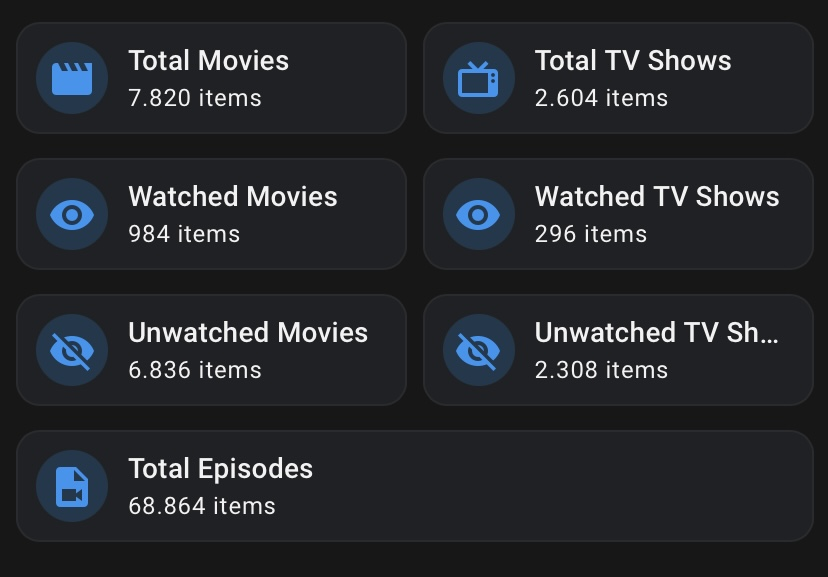

# Emby Stats

Home Assistant custom component for Emby statistics.

## Features
- Display recently added movies, series, total movies, total series, total episodes, watched/unwatched movies and series, more comming
- Customizable entity names and icons
- Automatically updates attributes from Emby server

---

## Installation Options

You can install Emby Stats via HACS or manually. Only use one method.

### Option 1: HACS Installation
1. Open Home Assistant → HACS → Integrations → “+”
2. Click Custom repositories
3. Add your GitHub repository URL: [https://github.com/YOUR_USERNAME/emby_stats](https://github.com/YOUR_USERNAME/emby_stats)  
   Select Integration as the type
4. Click Add
5. Install the component via HACS
6. Restart Home Assistant after installation

### Option 2: Manual Installation
1. Download or clone the repository using:  
   `git clone https://github.com/ZenyoMaarten/emby_stats.git`
2. Copy the folder `custom_components/emby_stats/` into your Home Assistant `config/custom_components/` directory
3. The folder structure should look like this:  
   config/custom_components/emby_stats/__init__.py  
   config/custom_components/emby_stats/manifest.json  
   config/custom_components/emby_stats/strings.json
4. Restart Home Assistant after copying

---

## Configuration in Home Assistant

---

## Using the Sensor
The sensor will automatically update its state and attributes from your Emby server.

Example Lovelace grid using button-card:  

type: grid  
columns: 3  
cards:  

If no image is available, a default empty poster will be displayed.

---

## Screenshots

---

## Notes
- Only use one installation method: HACS or manual  
- Always restart Home Assistant after installation  
- Make sure to add the integration to `configuration.yaml` for it to work  
- For issues or suggestions, open an issue on GitHub

---

## License
MIT
